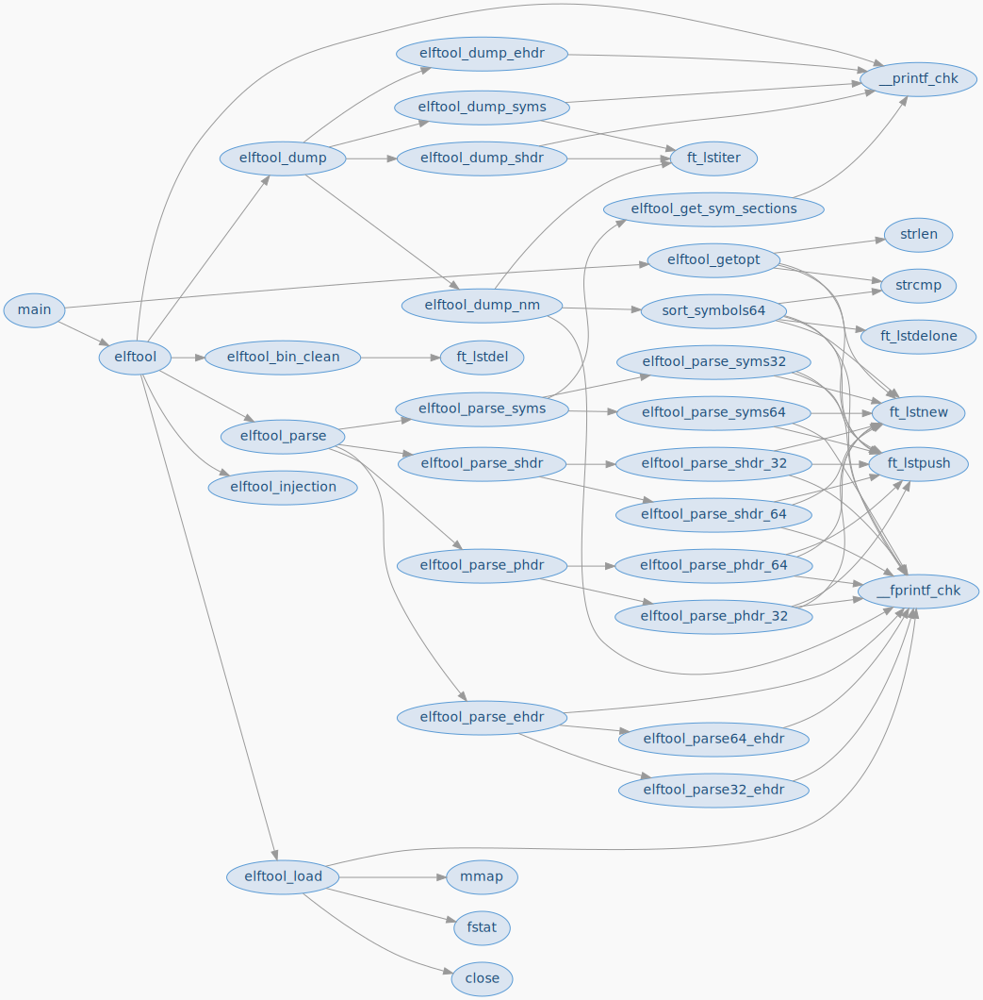

# GCC graph tool

A submodule gcc_graph_tool in the repository enable callgraph creation at compile time.
The tool use .cgraph output by GCC at IPA pass.
TODO :

- Link to tool website
- Link to tool repo
- Put the last CI svg output.

